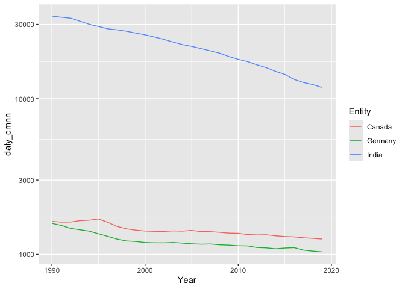
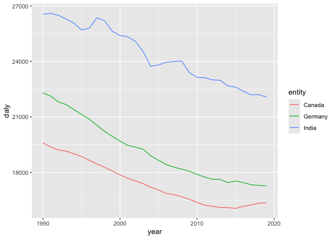
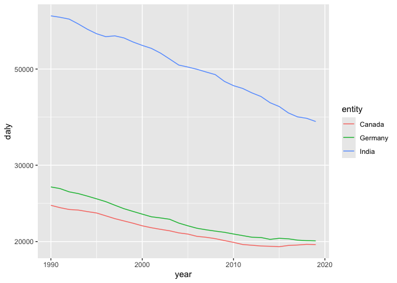

Global Disease Burden Analysis
================
Steffi Reisenauer (child 01), Steph Ross (child 02), Gayathri Mahendran
(child 03)

# Introduction

This document compares the Disability-Adjusted Life Year (DALY) diseases
burden for three countries: Germany, Canada, and India. We compare the
burden due to communicable, maternal, neonatal, and nutritional diseases
(CMNN), non-communicable diseases (NCDs), and overall disease burden for
these countries.

The source data is from the Institute for Health Metrics and Evaluation
(IHME) Global Burden of Disease (GBD) study.

# Communicable, Maternal, Neonatal, and Nutritional Disease Burden (CMNN)

## Table of Estimates for CMNN Burden Over Time

| Year |   Canada |  Germany |    India |
|-----:|---------:|---------:|---------:|
| 1990 | 1628.468 | 1581.431 | 33895.90 |
| 1991 | 1610.870 | 1534.790 | 33375.63 |
| 1992 | 1612.841 | 1468.267 | 32893.75 |
| 1993 | 1645.592 | 1438.674 | 31463.62 |
| 1994 | 1657.691 | 1409.525 | 30056.13 |
| 1995 | 1688.159 | 1355.051 | 29081.08 |
| 1996 | 1606.021 | 1304.176 | 28119.10 |
| 1997 | 1510.585 | 1252.101 | 27700.58 |
| 1998 | 1459.720 | 1219.134 | 27128.22 |
| 1999 | 1430.180 | 1209.316 | 26415.00 |
| 2000 | 1411.585 | 1191.178 | 25728.70 |
| 2001 | 1405.815 | 1185.846 | 24907.14 |
| 2002 | 1404.138 | 1184.905 | 24039.62 |
| 2003 | 1414.346 | 1191.913 | 23118.65 |
| 2004 | 1409.524 | 1180.416 | 22267.72 |
| 2005 | 1425.077 | 1169.103 | 21683.08 |
| 2006 | 1400.238 | 1161.764 | 20985.53 |
| 2007 | 1398.456 | 1165.466 | 20284.67 |
| 2008 | 1385.593 | 1151.658 | 19615.25 |
| 2009 | 1368.834 | 1145.662 | 18650.45 |
| 2010 | 1364.836 | 1134.785 | 17907.34 |
| 2011 | 1340.388 | 1132.113 | 17295.99 |
| 2012 | 1332.894 | 1106.245 | 16497.53 |
| 2013 | 1336.585 | 1100.323 | 15829.94 |
| 2014 | 1315.221 | 1085.785 | 14983.53 |
| 2015 | 1301.372 | 1097.201 | 14332.53 |
| 2016 | 1294.945 | 1103.710 | 13288.66 |
| 2017 | 1277.019 | 1063.944 | 12696.29 |
| 2018 | 1266.891 | 1048.096 | 12319.55 |
| 2019 | 1254.503 | 1036.394 | 11801.44 |

## Plot Showing Trends in CMNN Burden Over Time

<!-- -->

## Summary of CMNN Burden Findings

The DALY CMNN burden has decreased between 1990 and 2019 in all three
countries analyzed. Whereas Germany and Canada had a rather low DALY
CMNN of under 2000 in 1990, it was over 30,000 in India. While the score
decreased constantly in India in Germany, there is a plateau in Canada
from 1990 to 1995, with a decrease afterwards.

# Non-Communicable Disease Burden (NCD)

## Table of Estimates for NCD Burden Over Time

| year |   Canada |  Germany |    India |
|-----:|---------:|---------:|---------:|
| 1990 | 19593.93 | 22295.99 | 26554.09 |
| 1991 | 19377.91 | 22123.93 | 26596.63 |
| 1992 | 19209.89 | 21812.48 | 26494.62 |
| 1993 | 19149.74 | 21663.98 | 26294.26 |
| 1994 | 19003.90 | 21399.01 | 26072.98 |
| 1995 | 18860.08 | 21137.76 | 25704.34 |
| 1996 | 18655.65 | 20876.58 | 25794.08 |
| 1997 | 18457.68 | 20545.63 | 26355.52 |
| 1998 | 18276.44 | 20215.48 | 26193.81 |
| 1999 | 18076.19 | 19945.16 | 25628.72 |
| 2000 | 17862.21 | 19696.00 | 25402.28 |
| 2001 | 17679.90 | 19458.42 | 25326.27 |
| 2002 | 17536.40 | 19366.27 | 25087.93 |
| 2003 | 17390.18 | 19251.49 | 24536.36 |
| 2004 | 17198.10 | 18892.57 | 23726.90 |
| 2005 | 17049.11 | 18653.50 | 23809.74 |
| 2006 | 16861.82 | 18425.73 | 23947.92 |
| 2007 | 16789.43 | 18281.95 | 23997.51 |
| 2008 | 16682.26 | 18173.17 | 24014.73 |
| 2009 | 16539.79 | 18057.93 | 23396.45 |
| 2010 | 16379.09 | 17892.32 | 23134.68 |
| 2011 | 16225.64 | 17744.34 | 23120.89 |
| 2012 | 16165.93 | 17627.35 | 23002.85 |
| 2013 | 16102.23 | 17617.39 | 22981.07 |
| 2014 | 16093.64 | 17448.14 | 22676.67 |
| 2015 | 16054.63 | 17534.20 | 22608.59 |
| 2016 | 16161.82 | 17451.40 | 22389.00 |
| 2017 | 16233.64 | 17331.07 | 22197.81 |
| 2018 | 16335.44 | 17291.55 | 22204.26 |
| 2019 | 16352.54 | 17277.05 | 22071.57 |

## Plot Showing Trends in NCD Burden Over Time

<!-- -->

## Summary of NCD Burden Findings

The DALY is decreasing over time from 1990 to 2020. India has the
highest DALY compared to Germany and Canada. Canada has the lowest DALY.

# Overall Disease Burden

## Table of Estimates for Overall Disease Burden Over Time

| year |   Canada |  Germany |    India |
|-----:|---------:|---------:|---------:|
| 1990 | 24247.51 | 26732.42 | 66331.86 |
| 1991 | 23945.82 | 26500.18 | 65830.74 |
| 1992 | 23714.16 | 26045.71 | 65195.09 |
| 1993 | 23642.44 | 25804.22 | 63540.49 |
| 1994 | 23450.78 | 25461.21 | 61770.56 |
| 1995 | 23278.25 | 25099.20 | 60328.05 |
| 1996 | 22934.07 | 24728.42 | 59392.84 |
| 1997 | 22589.91 | 24260.00 | 59647.16 |
| 1998 | 22315.44 | 23815.04 | 58990.25 |
| 1999 | 22045.29 | 23470.49 | 57725.99 |
| 2000 | 21747.44 | 23137.66 | 56700.43 |
| 2001 | 21524.03 | 22814.83 | 55810.22 |
| 2002 | 21343.27 | 22676.03 | 54426.49 |
| 2003 | 21177.78 | 22516.73 | 52742.33 |
| 2004 | 20944.65 | 22063.44 | 51078.22 |
| 2005 | 20810.98 | 21747.46 | 50537.78 |
| 2006 | 20561.00 | 21463.56 | 49940.44 |
| 2007 | 20460.28 | 21289.70 | 49223.80 |
| 2008 | 20312.80 | 21141.56 | 48542.66 |
| 2009 | 20108.18 | 21007.76 | 46831.44 |
| 2010 | 19913.87 | 20819.46 | 45779.16 |
| 2011 | 19691.03 | 20643.51 | 45108.60 |
| 2012 | 19613.58 | 20467.08 | 44068.44 |
| 2013 | 19536.04 | 20436.08 | 43223.26 |
| 2014 | 19506.11 | 20234.97 | 41814.78 |
| 2015 | 19461.48 | 20351.35 | 40978.04 |
| 2016 | 19591.00 | 20295.31 | 39614.92 |
| 2017 | 19636.54 | 20152.54 | 38790.55 |
| 2018 | 19705.53 | 20099.16 | 38497.58 |
| 2019 | 19683.72 | 20075.12 | 37843.33 |

## Plot Showing Trends in Overall Disease Burden Over Time

<!-- -->

## Summary of Overall Disease Burden Findings

The chart illustrates a consistent decline in Disability-Adjusted Life
Years (DALYs) from 1990 to 2020 for Canada, Germany, and India. India
shows the highest DALYs but also the most significant reduction over
time, indicating substantial health improvements. In contrast, Canada
and Germany have lower DALYs, with more gradual decline.
